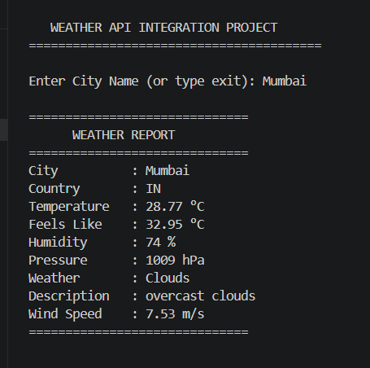

# Weather API Integration

## Description

This project fetches live weather information using the OpenWeatherMap API.

## Features

- Search weather by city
- Uses Requests library
- Parses JSON response
- Exception Handling
- Easy to use

## Technologies

- Python
- Requests
- JSON
- OpenWeatherMap API

## Run

pip install -r requirements.txt

python main.py

## Output Screenshots

### Weather Report - Mumbai

---